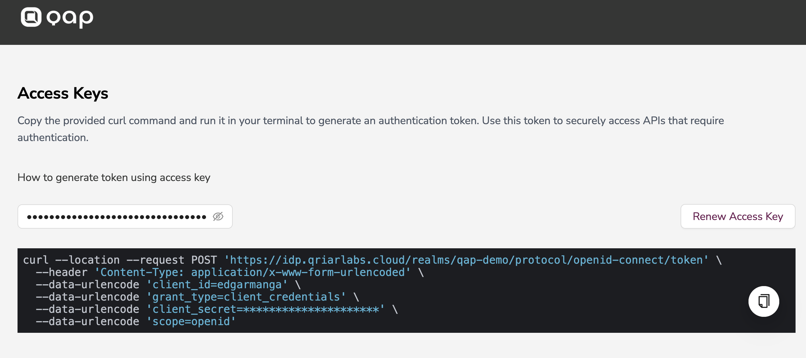

# Generating Tokens for APIs

This guide explains how to secure API executions using OAuth2 tokens generated through QIAM. By leveraging QIAM’s token management and validation, you can implement robust authentication and authorization for your APIs.

Keep in mind, that as a consumer, you already have the access for a consumer key and consumer secret

---

## Prerequisites

1. **QAP Credentials**:
   - Every consumer will have a pre-generated key and secret
2. **Configured Realm and Client**:
   - A realm in QIAM with a client configured.
   - Obtain the client ID and client secret (if required).
3. **QIAM User Accounts**:
   - Users should be created and assigned roles for authorization.
4. **Secured API**:
   - An API or service that will validate the tokens.



---

## Steps to Secure API with QIAM

### 1. Configure QIAM Client for API Access

1. **Create or Select a Client**:
   - Navigate to your QIAM admin console.
   - Select or create a client to represent your API.
2. **Enable Authorization**:
   - Set `Access Type` to `confidential` for server-to-server interactions or `public` for browser-based clients.
3. **Set Redirect URI**:
   - Configure the redirect URI, if applicable, based on the client type.

---

### 2. Obtain an Access Token

APIs require an access token for execution. Access tokens can be obtained by authenticating through QIAM using one of the supported OAuth2 grant types.

#### Example Using Resource Owner Password Grant:
```json
curl -X POST \
  -H "Content-Type: application/x-www-form-urlencoded" \
  -d "grant_type=password" \
  -d "client_id=<your-client-id>" \
  -d "client_secret=<your-client-secret>" \
  -d "username=<user-username>" \
  -d "password=<user-password>" \
  http://<QIAM-server>/realms/<realm-name>/protocol/openid-connect/token
